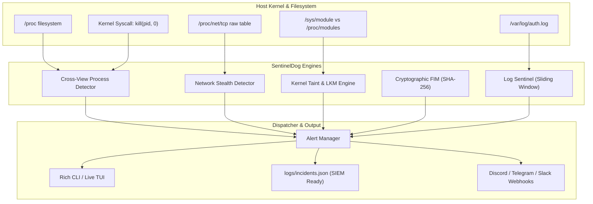

# SentinelDog 🐕‍🦺

<p align="center">
  
  
  
  
  
</p>

```
  ____             _   _            _ ____              
 / ___|  ___ _ __ | |_(_)_ __   ___| |  _ \  ___   __ _ 
 \___ \ / _ \ '_ \| __| | '_ \ / _ \ | | | |/ _ \ / _` |
  ___) |  __/ | | | |_| | | | |  __/ | |_| | (_) | (_| |
 |____/ \___|_| |_|\__|_|_| |_|\___|_|____/ \___/ \__, |
 Linux Security Watchdog & Rootkit Sentinel       |___/ 
```

**SentinelDog** is an autonomous, open-source Linux security monitoring daemon and diagnostic toolkit designed around the **Watchdog Design Pattern**. It bridges low-level kernel anomaly detection with real-time log event stream analytics.

Unlike passive security scanners that query standard operating system APIs, SentinelDog implements **Cross-View Discrepancy Analysis** (comparing high-level API views against direct kernel syscalls and raw `/proc` tables) to identify stealth **rootkits**, **hidden processes**, **dynamic linker hijacks (`LD_PRELOAD`)**, **tampered core utilities (FIM)**, and **real-time behavioral intrusions (SSH brute-force, privilege escalation)**.

---

## 📌 Theoretical Background & Architecture

### 1. What is a Rootkit & Why Traditional Tools Fail
A **rootkit** is not merely malware; it is a cloaking mechanism. When malware infects a system, it manipulates the "librarian" (the operating system APIs that answer queries about what is running).
- In **Userland (`LD_PRELOAD`)**, rootkits intercept libc functions like `readdir()`.
- In **Kernel space (LKM)**, rootkits hook system calls such as `sys_getdents64` to strip their process ID (PID) from directory listings.

Standard monitoring tools (`ps`, `top`, `netstat`) trust these APIs. When they ask *"What processes are running?"*, the hooked API filters out the malware's PID. To the administrator, the system appears clean.

### 2. The Cross-View Detection Principle
SentinelDog breaks this deception by asking the system the same question from **multiple independent perspectives**:

$$\text{Discrepancy} = \text{Kernel Task Truth} \setminus \text{Userland Enumerated View}$$

1. **Userland View ($V_A$)**: Retrieved via `ps` / standard `/proc` directory enumeration.
2. **Kernel Syscall Probing ($V_B$)**: Systematically probing every possible PID in range $1 \dots \text{PID\_MAX}$ using `os.kill(pid, 0)`.
   - In Unix kernels, `kill(pid, 0)` delivers no signal but asks the kernel scheduler: *"Does this process exist in the internal process table?"*
   - If the call succeeds (or returns `EPERM`), the process **definitely exists**.
   - If that PID was missing from $V_A$, **a rootkit has hooked the directory APIs to conceal it**. SentinelDog immediately raises a `CRITICAL` alert.



---

## ⚡ Key Features

| Subsystem | Detection Method | Threat Vector Targeted |
|---|---|---|
| **Process Cross-View** | `kill(pid,0)` sweep vs `/proc/[0-9]+` vs `psutil` | Kernel rootkits hooking `getdents64` (Diamorphine, Reptile) |
| **Userland Hooks** | `/etc/ld.so.preload` audit & `/proc/<pid>/environ` | Dynamic linker hijacking (`LD_PRELOAD` shared library injectors) |
| **Kernel Integrity** | `/proc/modules` unlinking vs `/sys/module/` kobjects | Stealth LKMs unlinking from module linked lists; Tainted kernels |
| **Hidden Ports** | Raw `/proc/net/tcp` vs `psutil` socket bindings | Backdoors filtering userland `ss` / `netstat` output |
| **File Integrity (FIM)** | SHA-256 cryptographic baselines & SUID flag diffs | Trojaned binaries (`/bin/ps`, `/bin/ls`, `/usr/bin/sudo`) |
| **Log Sentinel** | Async log stream tailing with sliding time windows | SSH brute-force bursts, `sudo` brute-force, rogue UID 0 creation |

---

## 🚀 Quickstart Guide

### Prerequisites
- Python 3.10+ on Linux (or Docker)
- Root/sudo privileges (recommended for full raw PID sweeps and `/proc` reads)

### 1. Installation

```bash
# Clone the repository
git clone https://github.com/caglayagmuryaylaci/sentineldog.git
cd sentineldog

# Create and activate virtual environment
python3 -m venv .venv
source .venv/bin/activate

# Install dependencies and SentinelDog CLI
pip install -r requirements.txt
pip install --no-build-isolation -e .
```

### 2. Establishing the Cryptographic Baseline (FIM)
Before running the watchdog, snapshot the known-good state of critical system binaries:

```bash
sentineldog baseline create
```

This hashes `/bin/ps`, `/bin/ls`, `/usr/bin/sudo`, `/etc/passwd`, and other security-sensitive paths into `data/fim_baseline.json`.

### 3. One-Shot Diagnostic Security Scan
Run a full diagnostic scan across all detectors:

```bash
# Quick diagnostic scan
sentineldog scan

# Full thorough 65535 PID sweep
sudo sentineldog scan --full
```

**Example Output:**
```
                         Diagnostic Scan Summary                          
┏━━━━━━━━━━━━━━━━━━━━━━━━━━━━━━━━━━━━━━━━━━━┳━━━━━━━━━━━━━━━━┳━━━━━━━━━━━┓
┃ Subsystem / Detector                      ┃ Status         ┃ Incidents ┃
┡━━━━━━━━━━━━━━━━━━━━━━━━━━━━━━━━━━━━━━━━━━━╇━━━━━━━━━━━━━━━━╇━━━━━━━━━━━┩
│ Process Cross-View (Syscall vs /proc)     │ PASSED (CLEAN) │         0 │
├───────────────────────────────────────────┼────────────────┼───────────┤
│ Dynamic Linker Hooks (/etc/ld.so.preload) │ PASSED (CLEAN) │         0 │
├───────────────────────────────────────────┼────────────────┼───────────┤
│ Kernel Modules & Taint Flags              │ PASSED (CLEAN) │         0 │
├───────────────────────────────────────────┼────────────────┼───────────┤
│ Hidden Sockets & Backdoors                │ PASSED (CLEAN) │         0 │
├───────────────────────────────────────────┼────────────────┼───────────┤
│ File Integrity Monitoring (FIM)           │ PASSED (CLEAN) │         0 │
└───────────────────────────────────────────┴────────────────┴───────────┘

✓ System integrity verified: No rootkit hooks or discrepancies found.
```

### 4. Continuous Watchdog Daemon Mode
Run SentinelDog as a live sentinel with periodic scans and real-time log event tailing:

```bash
sentineldog watch
```

---

## 🧪 Live Threat Simulation Suite (Demo / Presentation)

SentinelDog includes a **built-in threat simulation suite** (`tests/simulate_threats.py`) to demonstrate detection capabilities during internship reviews or security presentations:

```bash
python3 tests/simulate_threats.py
```

### Scenarios Simulated:
1. **SSH Brute-Force**: Emulates a dictionary attack on port 22; sliding window captures repeated authentication failures.
2. **Trojaned System Binary**: Replaces a monitored binary with a malicious payload; FIM catches SHA-256 mismatch.
3. **Privilege Escalation Risk**: Detects unauthorized permissions (e.g. world-writable permissions or SUID flags).
4. **Rogue UID 0 Backdoor Account**: Emulates unauthorized user creation with Root privileges (`UID=0`).

All simulated incidents are rendered in colored Rich panels and appended to `logs/simulation_incidents.json`.

---

## 🐳 Docker Deployment

To run SentinelDog in an isolated Linux container with host process visibility:

```bash
docker compose up -d --build
```

View real-time watchdog logs:
```bash
docker logs -f sentineldog-sentinel
```

---

## ⚙️ Configuration (`config/watchdog.yaml`)

```yaml
general:
  service_name: "sentineldog"
  check_interval_seconds: 5
  deep_scan_interval_seconds: 30

alerts:
  console_output: true
  json_log_path: "logs/incidents.json"
  webhook_url: null # Optional: "https://discord.com/api/webhooks/..."

rootkit_detection:
  enabled: true
  enable_cross_view: true
  enable_ld_preload: true
  enable_kernel_modules: true
  enable_hidden_network: true
  max_pid_sweep: 65535

file_integrity:
  enabled: true
  baseline_path: "data/fim_baseline.json"
  monitored_paths:
    - "/etc/passwd"
    - "/etc/shadow"
    - "/bin/ps"
    - "/bin/ls"
    - "/usr/bin/sudo"

log_sentinel:
  enabled: true
  target_logs:
    - "/var/log/auth.log"
    - "/var/log/secure"
  rules:
    ssh_brute_force:
      threshold: 5
      window_seconds: 60
```

---

## 🛡️ Production Systemd Service

To deploy SentinelDog as a persistent background daemon on a production Linux server:

```bash
sudo bash scripts/install_service.sh
```

Check daemon status:
```bash
sudo systemctl status sentineldog
```

Follow journal logs:
```bash
sudo journalctl -u sentineldog -f
```

---

## 🧪 Running Unit Tests

```bash
pytest -v
```

```
tests/test_cross_view.py::test_cross_view_clean_state PASSED             [ 11%]
tests/test_cross_view.py::test_cross_view_detects_hidden_from_userland PASSED [ 22%]
tests/test_cross_view.py::test_cross_view_detects_stealth_kernel_rootkit PASSED [ 33%]
tests/test_fim.py::test_fim_detects_file_tampering PASSED                [ 44%]
tests/test_fim.py::test_fim_detects_file_deletion PASSED                 [ 55%]
tests/test_log_rules.py::test_ssh_brute_force_detection PASSED           [ 66%]
tests/test_log_rules.py::test_sudo_abuse_detection PASSED                [ 77%]
tests/test_log_rules.py::test_rogue_uid0_account_detection PASSED        [ 88%]
tests/test_log_rules.py::test_webshell_spawn_detection PASSED            [100%]
```

---

## 📄 License

This project is open-source under the [MIT License](LICENSE).
Developed for academic, research, and security internship demonstration purposes.
